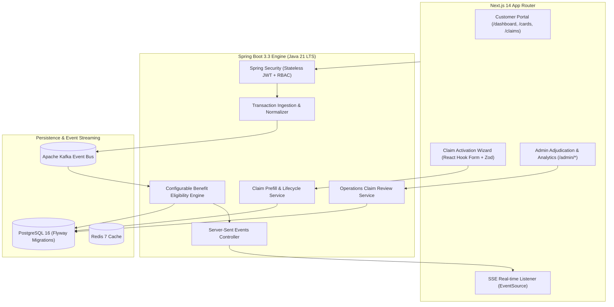

# Card Benefits Activation Engine (CBAE)

> **Autonomous Value Realization for Built-In Credit Card Insurance Protections**

The **Card Benefits Activation Engine (CBAE)** is an event-driven fintech platform that monitors credit card transactions, automatically evaluates eligibility for built-in card protections (Purchase Protection, Return Protection, and Travel Delay Insurance), surfaces explainable opportunities in real-time, and streamlines prefilled claim filing and adjudication.

---

## 🌐 Live Demo & Public Deployment

- **Public Frontend URL**: [https://cbae-frontend.onrender.com](https://cbae-frontend.onrender.com)
- **Public Backend API**: [https://cbae-backend.onrender.com/api/v1](https://cbae-backend.onrender.com/api/v1)
- **Swagger API Docs**: [https://cbae-backend.onrender.com/swagger-ui.html](https://cbae-backend.onrender.com/swagger-ui.html)

### Demo Credentials (Pre-seeded)
| Persona | Email | Password | Role / Scope |
| :--- | :--- | :--- | :--- |
| **Cardholder (Customer)** | `customer@example.com` | `Password123!` | Dashboard, Benefits, Claim Activation Wizard, SSE Alerts |
| **Operations Admin** | `admin@cbae.internal` | `AdminSecure2026!` | Claims Adjudication Queue, Decisions, Value Analytics |

---

## 🌟 Key Capabilities

1. **Intelligent Real-Time Benefit Engine**: Evaluates card swipes against configurable policy parameters (MCC categories, swipe amounts, coverage windows, common carrier delay thresholds).
2. **Three Core Built-In Protections**:
   - **Purchase Protection**: Covers theft and accidental damage within 90 days of purchase (up to \$10,000/claim).
   - **Return Protection**: Reimburses purchases when a retail merchant refuses an item return within 45 days (up to \$300/item).
   - **Travel Delay Insurance**: Automatically flags common carrier delays $\ge 6$ hours to cover lodging, meals, and emergency transit expenses (up to \$500/incident).
3. **Zero Re-Entry Claim Prefill**: Aggregates authoritative transaction records, card details, merchant names, and policy terms directly into claim drafts.
4. **Operations Adjudication Portal**: Comprehensive admin claims queue, evidence review console, state-machine-backed determination controls (Approve, Partial, Request Info, Reject), and value realization analytics.
5. **Real-Time Notification Stream**: Server-Sent Events (SSE) notification streaming updating the client application without page reloads.
6. **Deterministic Demo Runner**: Interactive one-click demo console (`/demo`) executing end-to-end positive and negative test scenarios.

---

## 🏛️ Application Routes Catalog

### Public & Authentication
- `/` — Landing page with benefit pillars, interactive demos, and product walkthrough
- `/login` — Sign in with instant demo account presets
- `/register` — Customer account registration

### Customer Portal
- `/dashboard` — Value realization hero metrics, active opportunities feed, recent transactions, and quick scenario simulator drawer
- `/benefits` & `/opportunities` — Enrolled card protection policies hub and filterable opportunities feed
- `/opportunities/[id]` — Opportunity detail with explainability checklist and *"Activate Benefit & Start Claim"* modal
- `/cards` & `/cards/[id]` — Enrolled virtual glass cards portfolio and policy coverage breakdown
- `/transactions` & `/transactions/[id]` — Transaction search table and transaction detail description list
- `/claims` & `/claims/[id]` — Active filed claims list, lifecycle tracking timeline, and supplementary evidence uploader
- `/notifications` — Real-time notification center with tabbed filtering (`All`, `Unread`, `Benefits`, `Claims`)
- `/demo` — Deterministic 4-scenario end-to-end execution runner

### Operations & Admin Portal (`ROLE_ADMIN`)
- `/admin` — Operations summary dashboard with active queue counts, approved payout volume, and priority review preview
- `/admin/claims` — Searchable and filterable claims adjudication queue
- `/admin/claims/[id]` — Claim detail workspace with customer statements, evidence inspection, and determination modals
- `/admin/analytics` — Value realization analytics, benefit activation funnel, and protection domain breakdown

---

## 🏗️ Architecture & Technology Stack



---

## ⚡ Local Setup & Execution

### 1. Prerequisites
- **Java 21 LTS** (`JAVA_HOME` pointing to JDK 21)
- **Node.js 20+**
- **Docker & Docker Compose**
- **Maven 3.9+**

### 2. Start Infrastructure
```bash
docker compose up -d
```

### 3. Start Backend
```bash
cd backend
mvn clean package -DskipTests
mvn spring-boot:run
```
*Backend runs on `http://localhost:8080`. Swagger UI at `http://localhost:8080/swagger-ui.html`.*

### 4. Start Frontend
```bash
cd frontend
npm install
npm run dev
```
*Frontend runs on `http://localhost:3000`.*

---

## 🧪 Running Test Suites

```bash
# Frontend Unit & Component Tests (Vitest)
cd frontend && npm test

# Frontend Lint & Typecheck
cd frontend && npm run lint && npm run typecheck

# Frontend Production Build
cd frontend && npm run build

# Backend Test Suite (JUnit 5 / Java 21)
cd backend && mvn clean test
```

---

## 📚 Documentation
- [Detailed System Architecture](docs/ARCHITECTURE.md)
- [Deterministic Demo Walkthrough & Credentials](docs/DEMO_GUIDE.md)
- [Security Specifications & Hardening](docs/SECURITY.md)
- [Design System & UI Tokens](docs/DESIGN_SYSTEM.md)
