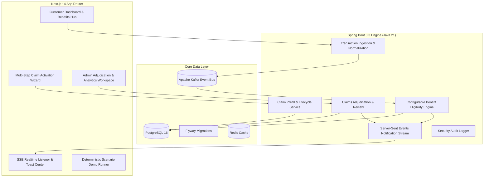
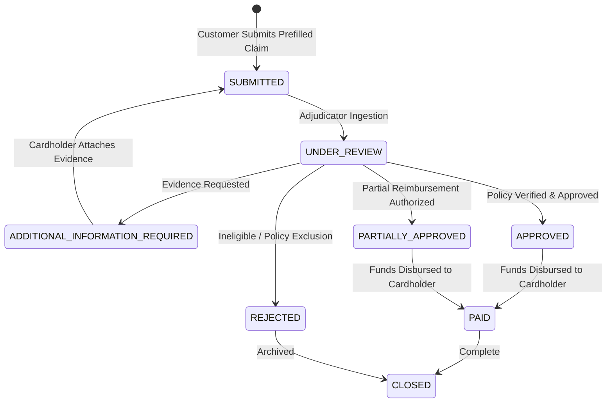

# Card Benefits Activation Engine — Architecture Documentation

## 1. System Overview

The **Card Benefits Activation Engine (CBAE)** is an enterprise-grade fintech platform that automatically analyzes credit card transactions in real time, determines qualifying built-in insurance protection benefits (Purchase Protection, Return Protection, and Travel Delay Insurance), surfaces eligible opportunities with explainability, and streamlines prefilled claim activation.

---

## 2. High-Level Architecture

---

## 3. Technology Stack

### Backend
- **Language & Runtime**: Java 21 LTS
- **Framework**: Spring Boot 3.3.0
- **Security**: Spring Security 6 with Stateless JWT Bearer Tokens & Method-Level RBAC (`ROLE_CUSTOMER`, `ROLE_ADMIN`)
- **Database & Migration**: PostgreSQL 16 with Flyway schema versioning
- **Message Broker & Event Streaming**: Apache Kafka (transaction streams and claim lifecycle events)
- **Caching**: Redis 7
- **API Documentation**: OpenAPI 3.0 / Swagger UI (`/swagger-ui.html`)
- **Testing**: JUnit 5, Mockito, Spring Boot Test, H2 In-Memory database for deterministic unit & integration tests

### Frontend
- **Framework**: Next.js 14 (App Router)
- **Language**: TypeScript 5 (Strict Mode)
- **Styling**: Tailwind CSS, PostCSS, Custom Aceternity-inspired Glassmorphism Tokens
- **Icons**: Phosphor Icons React
- **Motion & Micro-interactions**: Framer Motion
- **State & Server Cache**: TanStack React Query 5
- **Forms & Validation**: React Hook Form + Zod
- **Real-Time Streaming**: Server-Sent Events (`EventSource`)
- **Toasts**: Sonner
- **Testing**: Vitest, React Testing Library, Playwright E2E

---

## 4. Benefit Rule Engine Architecture

The eligibility engine evaluates credit card swipes against configured benefit policies:

| Benefit Type | Qualifying Conditions | Coverage Limits | Evidence Required |
| :--- | :--- | :--- | :--- |
| **Purchase Protection** | MCC 5732, 5311, 4812, 5946; within 90 days of purchase; $\ge \$50.00$ | Up to \$10,000 per claim (\$50,000 annual max) | Itemized purchase receipt, damage/theft photo |
| **Return Protection** | Physical retail purchases (MCC 5651, 5621, 5611); within 45 days of purchase; merchant return refusal | Up to \$300 per item (\$1,000 annual max) | Original receipt, store return denial documentation |
| **Travel Delay Insurance** | Common carrier airfare / rail (MCC 3000–3299, 4112, 4511); delay $\ge 6$ hours | Up to \$500 per incident | Airline delay statement, boarding pass, expense receipts |

---

## 5. Claim State Machine

